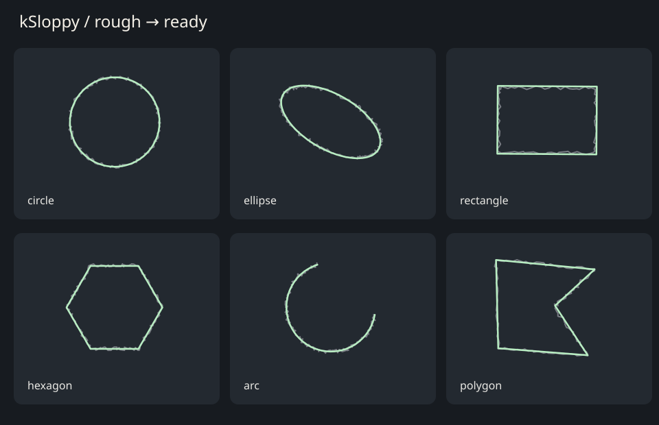

# kSloppy

Sketch a questionable circle. Press Enter. Get a circle.



A free, local Krita Python plugin for turning a single rough stroke into clean,
editable vector geometry. No AI service, account, NumPy, or extra Python packages.

## Install

For **desktop Krita 5.x with Python/PyQt5 support** (Linux, Windows, macOS).
Krita 6 / Qt6 and Android are not currently supported by this release.

1. Download this repository using **Code → Download ZIP**, and extract it.
2. In Krita, open **Settings → Manage Resources → Open Resource Folder**.
3. Copy `ksloppy.desktop` and the entire `ksloppy` folder into its `pykrita` folder
   (create `pykrita` if needed).
4. Restart Krita. Open **Settings → Configure Krita → Python Plugin Manager**,
   enable **kSloppy**, then restart again.

Alternatively, run `python3 package.py` and import `dist/kSloppy.zip` through
**Tools → Scripts → Import Python Plugin**. Successful GitHub Actions runs also
provide the importable ZIP in the **kSloppy-plugin** artifact.

## Use

1. Open a document and choose your foreground color, brush size, and opacity.
2. Press **Ctrl+Alt+S**, or choose **Tools → Scripts → kSloppy: Sloppy Shapes**.
3. Draw a rough shape over the document preview in the drawing workspace.
4. Press **Enter** to perfect it. Pick a shape in the dropdown to override the guess.
5. Draw another shape to keep the cleaned one in the preview, or press
   **Ctrl+Enter / Apply shapes** to add everything as a new vector layer.

This version uses a dedicated drawing workspace within Krita. It **does not
watch or replace ordinary freehand brush strokes on the main canvas**. Preview
scribbles never touch your artwork. Closing asks before discarding pending work.

| Control | Action |
|---|---|
| Enter | Fit/refit current stroke |
| Ctrl+Enter | Apply preview as a new vector layer and close |
| Backspace | Discard current stroke, or last staged shape |
| Mouse wheel | Zoom around the pointer |
| Middle-button drag | Pan |
| Fit view | Show whole document |
| Shape | Override automatic recognition |
| Sides | Choose 3–64 sides for a regular polygon |
| Corner detail | Preserve more/fewer corners in irregular polygons |
| Outline / Fill | Set shared styling for this batch |

To reassign the opening shortcut, search for **kSloppy** under
**Settings → Configure Krita → Keyboard Shortcuts**.

## Shapes

- Lines and open polylines.
- Circles and rotated ellipses, saved as true SVG ellipses.
- Rectangles and squares at arbitrary angles.
- Triangles, hexagons, and other regular polygons (3–64 sides by explicit setting).
- Irregular and concave polygons: straighten edges while preserving the outline.
- Circular arcs in either direction, including arcs larger than a semicircle.

Draw a closed shape in one continuous stroke, ending near its start. Draw an arc
without closing it. Automatic detection is heuristic; if a many-sided polygon
looks like a circle, use **Regular polygon** and specify the sides. “All polygons”
means a generic polygon simplifier, not a promise to infer arbitrary intent from
any scribble. Self-intersecting strokes may need a manual override.

## Details and limitations

- Output is a smooth, constant-width vector outline, optionally filled. It uses
  your foreground color, size and opacity when opening the workspace, but does
  not reproduce brush texture, pressure width, erasing, selections, masks, or
  brush blending modes. It adds a new layer above the document's existing layers.
- Styling controls apply to every shape in the current preview batch.
- A new stroke discards an unperfected rough stroke; press Enter before starting
  another if you want to keep it.
- The artwork preview is capped at 1800 px; geometry is stored in full document
  coordinates, independent of preview size and zoom. Very large documents may
  therefore look soft while zoomed in.
- Vector output uses explicit physical SVG dimensions to match document DPI.
- Remove an applied batch by deleting its named kSloppy layer. Preview discard
  uses Backspace; this plugin does not promise one-step native undo grouping.
- Circular arcs are supported; general elliptical arcs and multi-stroke shape
  assembly are not currently implemented.

## Development and validation

```sh
python3 -m unittest discover -s tests -p 'test_*.py' -v
python3 package.py
# Requires Krita, xvfb, and Krita's system Python/PyQt5 support:
python3 tests/run_krita_smoke.py
```

CI runs synthetic noisy-stroke regression tests, installs the plugin into an
isolated profile, opens real Krita under Xvfb, drives Qt mouse input, fits and
applies a circle, and checks vector placement at 72 and 300 DPI. It saves previews,
KRA documents, and logs as artifacts. Physical stylus hardware is not tested by CI.

API references: [Krita Python plugin guide](https://docs.krita.org/en/user_manual/python_scripting/krita_python_plugin_howto.html),
[VectorLayer](https://api.kde.org/legacy/krita/html/classVectorLayer.html),
[View](https://api.kde.org/legacy/krita/html/classView.html).

MIT licensed.
